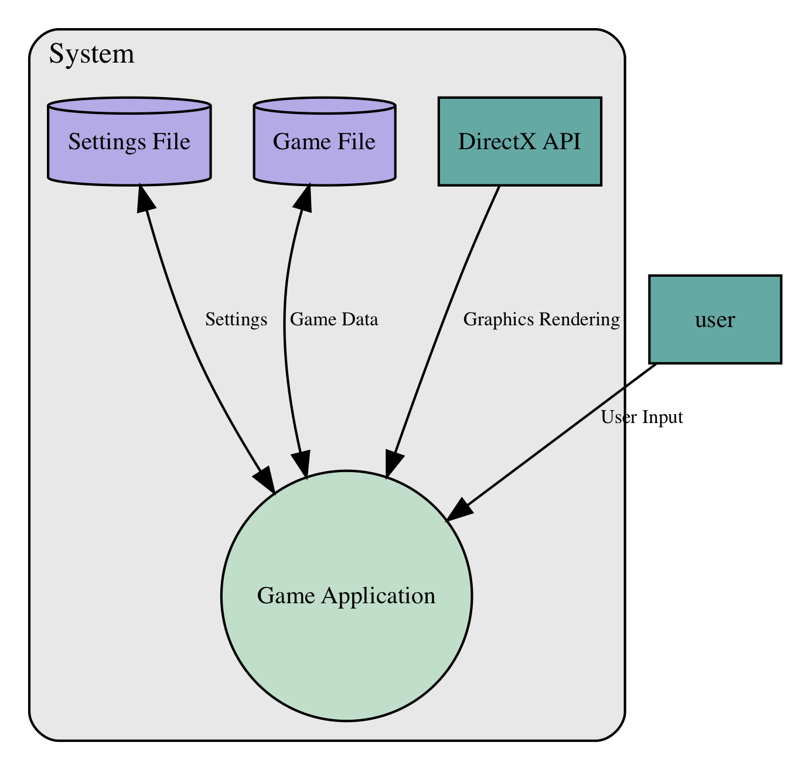

# threat-modeling
[](https://circleci.com/gh/redshiftzero/threat-modeling)

**Note:** this is an experimental tool in the alpha stage that is under active development, the API and YAML spec format may change.

This is a library of threat modeling tools in Python inspired by related projects like [pytm](https://github.com/izar/pytm). Data Flow Diagrams (DFDs) can be generated using a YAML specification of the system architecture. If you include the threats and their child-parent relationships in the YAML specification, you can also generate attack trees.

This YAML document can be stored in version control and updated to keep track the DFD structure, the list of threats that have been considered, their mitigation status, and what compensating security controls have been applied.

This library considers countermeasures to be first-class objects, in addition to threats and DFD elements. This is done to make it easier to track _why_ countermeasures have been implemented/applied and to aid decision-making when deciding between implementing various proposed countermeasures.

There is also a `threatmodel --check` option which is effectively a linter and can be run
in your CI/CD pipeline (see CircleCI job `examples` and the Linter section below) to flag issues.

# Installation

```
pip install --editable .
```

# CLI usage

```
$ threatmodel --help
usage: threatmodel [-h] [--check] [--attack-trees] [--dfd]
                   [--generate-threats]
                   input

positional arguments:
  input               system specification (yaml)

optional arguments:
  -h, --help          show this help message and exit
  --check             lint/check your threat model definition
  --attack-trees      generate attack trees
  --dfd               generate data flow diagram
  --generate-threats  generate threats
```

# Linter

`threatmodel --check` will look for the following:

* (fails linter) threats that have not been triaged (i.e. have the status of unmanaged)
* (fails linter) references to child threats that do not exist
* (fails linter) references to mitigations that do not exist


# Data Flow Diagram

## YAML-based system specification

The following YAML is an example specification (example taken from [this paper (PDF)](https://www.cs.cmu.edu/~mabianto/papers/07_ase.pdf)):

```yaml
---
name: Minesweeper
description: Minesweeper threat model

nodes:
  - name: Settings File
    type: Datastore
    id: DFD1

  - name: Game File
    type: Datastore
    id: DFD2

  - name: DirectX API
    type: ExternalEntity
    id: DFD3

  - name: user
    type: ExternalEntity
    id: DFD4

  - name: Game Application
    type: Process
    id: DFD5

boundaries:
  - name: System
    members:
      - DFD1
      - DFD2
      - DFD3
      - DFD5

dataflows:
  - name: Settings
    first_node: DFD1
    second_node: DFD5
    bidirectional: True

  - name: Game Data
    first_node: DFD2
    second_node: DFD5
    bidirectional: True

  - name: Graphics Rendering
    first_node: DFD3
    second_node: DFD5

  - name: User Input
    first_node: DFD4
    second_node: DFD5
```

You can use this as follows:

```
$ threatmodel --dfd minesweeper.yaml
[*] DFD saved in dfd.png
```

This will generate the following Data Flow Diagram:



# Threats

You can add the threats key to your system YAML to load existing threats for your system, for example:

```
threats:
- id: THREAT1
  name: Attacker tampers with config file
  description: An attacker is able to introduce malicious changes into the settings file
  status: Unmanaged
  base_impact: Medium
  base_exploitability: Medium
  dfd_element: DFD1
  threat_category: Tampering
  mitigations:
    - MITIG1
```

### Allowed keys for threats

* `name` (required)
* `id` (optional)
* `description` (optional)
* `status` (optional, defaults to unmanaged if missing)
* `base_impact` (optional)
* `base_exploitability` (optional)
* `dfd_element` (optional)
* `threat_category` (optional, defaults to unknown if missing)
* `child_threats` (optional, list of threat IDs that an attacker can attempt next)
* `mitigations` (optional, list of mitigation IDs that have been applied to this threat)

## Threat Generation

To generate stub threats for later analysis:

```
$ threatmodel --generate-threats examples/minesweeper.yaml
[⏳] Loading threat model, standby!
[🔪] New threats found! Saved in examples/minesweeper_generated.yaml.
```

# Mitigations

You can add the mitigations key to store information about your applied mitigations in version control:

```
mitigations:
- id: MITIG1
  name: Restrictive permissions on configuration file.
  description: Prevents unauthorized users from writing changes to the Minesweeper configuration file.
```

### Allowed keys for mitigations

* `name` (required)
* `id` (optional)
* `description` (optional)
